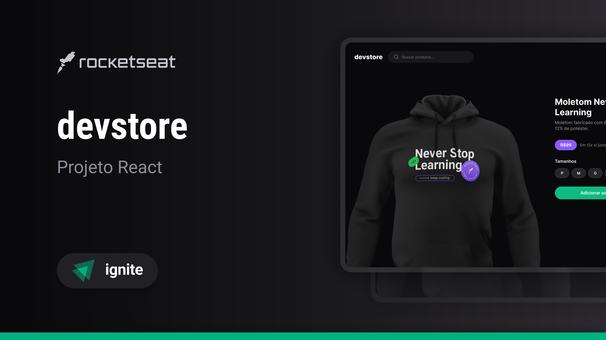

<h1 align="center">Ignite devstore</h1>
<p align="center">
  <a href="#-tecnologias">Tecnologias</a>&nbsp;&nbsp;&nbsp;|&nbsp;&nbsp;&nbsp;
  <a href="#-projeto">Projeto</a>
</p>


<p align="center">
  
</p>

## 🚀 Tecnologias

Esse projeto foi desenvolvido com as seguintes tecnologias:

## Front-End
- NextJs
- React
- TypeSrcipt
- Tailwindcss
- Tailwind merge
- Lucide
- Git e Github
- Figma


## 💻 Executando

Após clonar o repositório, acesse as pastas do projeto e execute os comandos abaixo:


## Web

> Instale as dependências:

```bash
npm install
```


> Inicie o Projeto:

```bash
npm run dev
```

>Acesse [http://localhost:5173](http://localhost:3000) para visualizar a aplicação web.


---

Feito com ♥ by Kauã :wave: